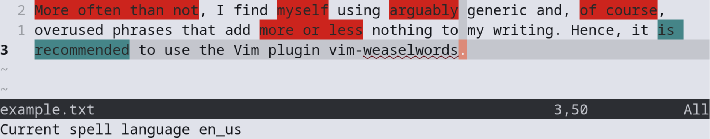

# vim-weaselwords

Improve your writing in Vim by highlighting weasel words.
The plugin highlights weaselwords in red and passive sentences in blue. Example:



## Features

- Simply based on word lists that the user can edit or a community can maintain.
- No need to connect to the internet. Your texts stay in your editor.
- Experimental passive detection for English

### Supported Languages
- English
- German
- French (basic)
- Spanish (basic)

## Installation

| Plugin Manager | Plugin Section |
| --- | --- |
|Vim-Plug | `Plug 'mo42/vim-weaselwords'` |
|pathogen.vim| `Plug 'mo42/vim-weaselwords'` |
|Vundle | `Plugin 'mo42/vim-weaselwords'` |

Then, run `:PluginInstall` (Vundle) or `:PlugInstall` (Vim-plug).

## Usage

### Highlight weasel words

`call HighlightWeaselWords(spell_language)`

Currently, this plugin includes English ('en_us') and German ('de_de').
Calling this function with another languages clears previous highlights. To
clear existing highlights call with the empty string:

`call HighlightWeaselWords('')`

### Highlight passive sentences:

`call HighlightPassive(g:current_spell_language)`

### Cycling through spell checkers, weasel words and passive
VimScript for cycling through spell checkers and enabling corresponding weasel
words:

```vim
nnoremap <leader>l :call CycleSpellLanguage()<cr>
let g:current_spell_language = ''
function CycleSpellLanguage()
  let languages = ['', 'en_us', 'de_de']
  let i = (index(languages, g:current_spell_language) + 1) % len(languages)
  let g:current_spell_language = languages[i]
  call HighlightWeaselWords(g:current_spell_language)
  call HighlightPassive(g:current_spell_language)
  if empty(g:current_spell_language)
    set nospell
    echo 'No spell language'
  else
    set spell
    let &spelllang=g:current_spell_language
    echo 'Current spell language ' . g:current_spell_language
  endif
endfunction
```

## License

This project is licensed under the MIT License - see the LICENSE file for details.
